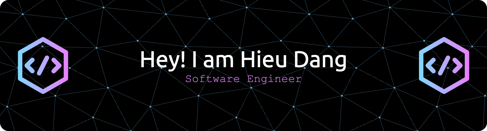

<h1 align="center">Hi 👋, I'm Hieu Dang</h1>
<h3 align="center">Mobile Software Engineer</h3>

- 🔭 I’m currently working on [Tekai](https://tekai.vn/)

- 🌱 I’m currently learning **Kotlin**

- 👨‍💻 All of my projects are available at [My Portfolio](https://datrhi.github.io/portfolio/)

- 💬 Ask me about **ReactJs, React Native**

- 📫 How to reach me **hieuvnuet@gmail.com**

<h3 align="left">Connect with me:</h3>

<h3 align="left">Languages and Tools:</h3>

                    

